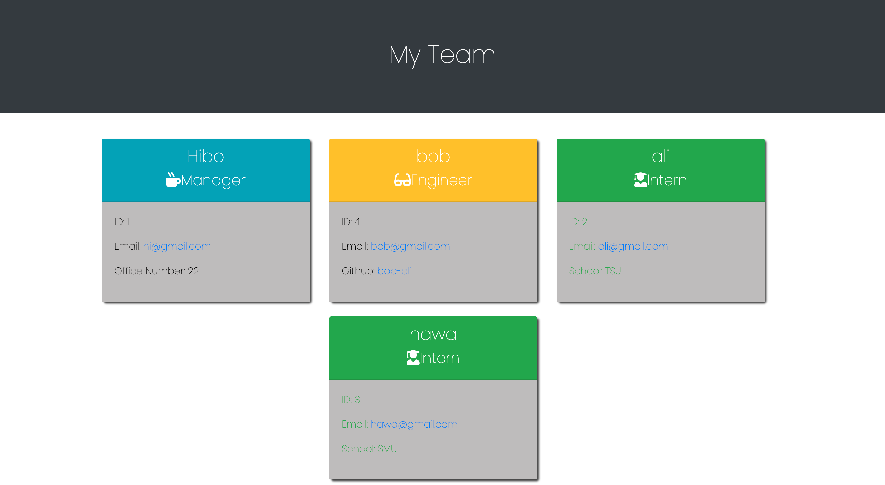

# Employee-Profile-Generator

# testing

## Description
 This node.js based web application will render a HTML page with basic information of Employees. When it is cloned and installed properly, all you have to do is follow the prompts to make this web application functional!
***
## Table of Contents
* [Installation](#installation)
* [Usage](#usage)
* [License](#license)
* [Contributing](#contributing)
* [Tests](#tests)
* [Questions](#questions)
***
## Installation
* npm install
* node index.js

## Usage
* [View walkthrough video here:](https://drive.google.com/file/d/1ATx3jqJ1TDT4VkSVciYcDbgyWZIMb6ve/view)

## License

## Contributing
If you would like to contribute to this project, please [add me on GitHub](https://github.com/hibo-ali).
## Tests
* npm install
* node index.js
* Follow the prompts to render html page
## Questions
Please reach out to me via Github:
* [Github](https://github.com/hibo-ali)

## [Url](https://hibo-ali.github.io/Employee-Profile-Generator)
